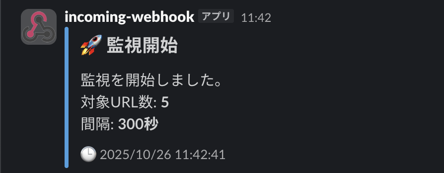
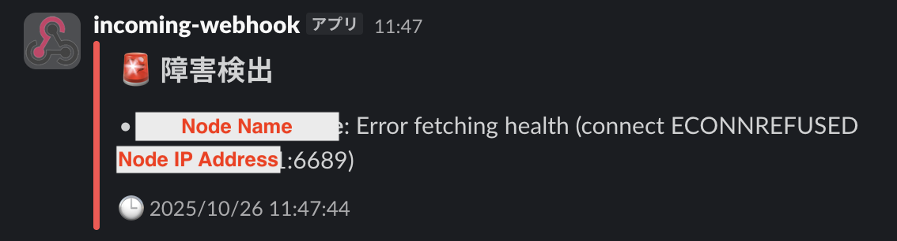
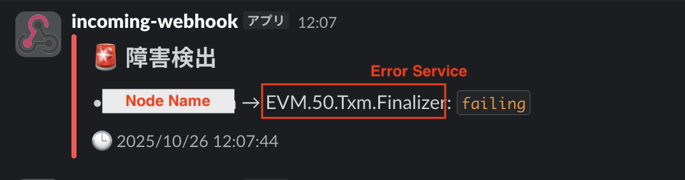
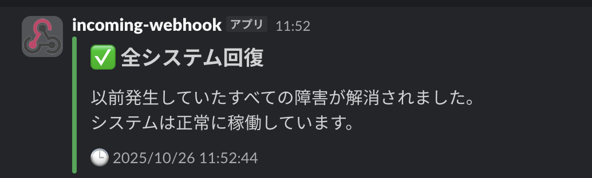
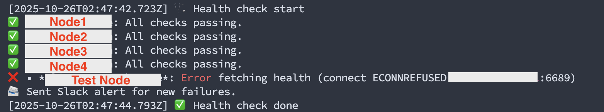
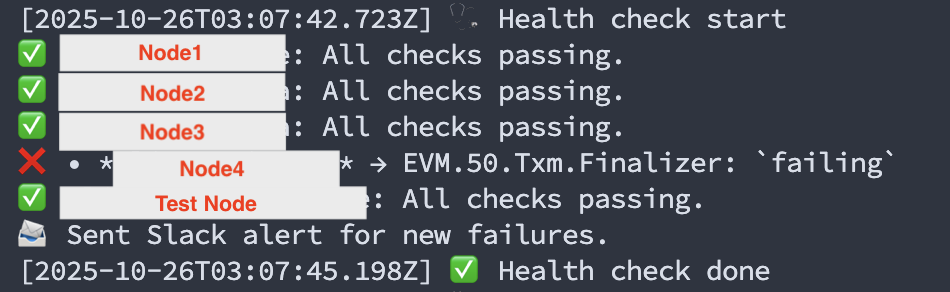

# 機能概要
このツールはPluginモジュールのヘルスチェック機能を用いてPlugin Nodeの状態を監視します。<br>

# 前提
このツールでは下記を利用します。
## Slack
エラー通知にSlackのIncoming Webhooks機能を使うため、Webhook URLを取得する必要があります。<br>
Slackの登録方法は以下を参照してください。<br>
https://qiita.com/11ppm/private/c23f1bf19043fa6e3afb

## PM2
監視処理の永続化のため、Node.jsのプロセス管理アプリケーションであるPM2を利用します。<br>

### インストール手順
#### NPMインストール
```
cd ~
curl https://raw.githubusercontent.com/creationix/nvm/master/install.sh | bash
```
```
source ~/.nvm/nvm.sh
```
```
nvm install stable --latest-npm
nvm alias default stable
```

#### PM2インストール
```
npm install pm2 -g
```

# 使い方
## リポジトリのクローン
```
git clone https://github.com/AoiToSouma/pliNode-checkHealth.git
cd pliNode-checkHealth
```

## 環境設定
ご自身の環境に合わせて環境変数を変更します。<br>
- HEALTH_URLS : 監視対象のPlugin NodeのURLです。6689ポートの/healthを監視します。
- SLACK_WEBHOOK_URL : Slack通知のためのWebhook URLです。
- INTERVAL_SECONDS : 監視間隔です。（デフォルトは5分）

```
nano config.json
```

## 実行
```
pm2 checkHealth.js
```
```
pm2 save
```
### Slack通知
- 監視スタート

- エラー検知（Nodeダウン）

- エラー検知（Serviceダウン）

- 復旧検知


### PM2 ログ
状態はPM2ログにも記録されています。<br>
ログの時間は日本時間表記です。


